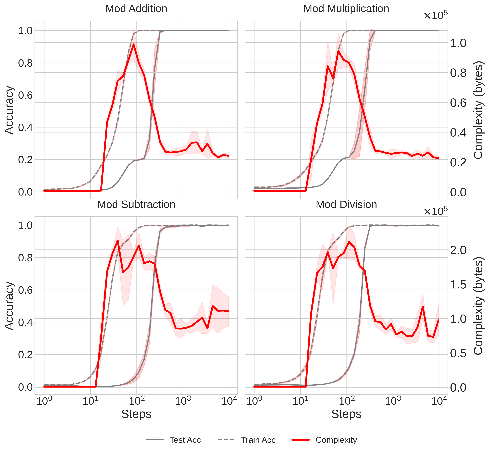

# GrokkingComplexity
Code for [The Complexity Dynamics of Grokking](http://arxiv.org/abs/2412.09810)

Running [coffee.py](coffee.py) with the relevant options will train a transformer on modular arithmetic data, and compute the complexity of the network throughout training. We find that with proper regularization, network complexity consistently exhibits a characteristic rise and fall of complexity:



The primary function of interest in ```coffee.py``` is ```bayes_optimize_svd_quantization```. This function defines the coarse-graining procedure discussed in the paper: we iteratively Bayes optimize coarse-graining parameters which control the degree of effective model quantization and low-rank approximation, where the cost function is the final compressed size of the network weights using a simple off-the-shelf compressor: ```bzip2```. THe spectral entropy penalty mentioned in the paper is defined in the funciton ```spectral_entropy_penalty```.

This initial release has not been cleaned up at all, and is exactly what we ran for the experiments in the paper. We hope to release a complexity package to automatically calculate network complexity for a range of network types, but have not yet created this package. If contributors want to assist and submit PRs towards creating a generic complexity package, we're open to that!
